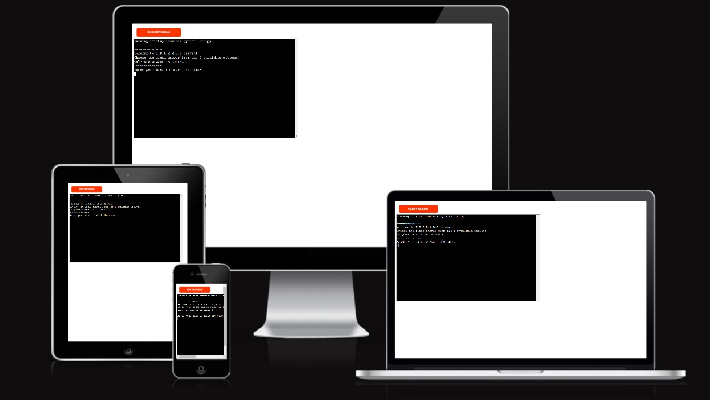
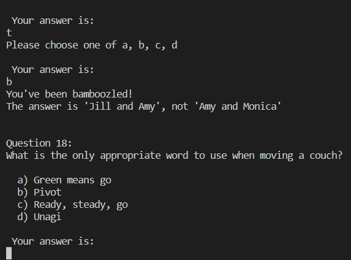
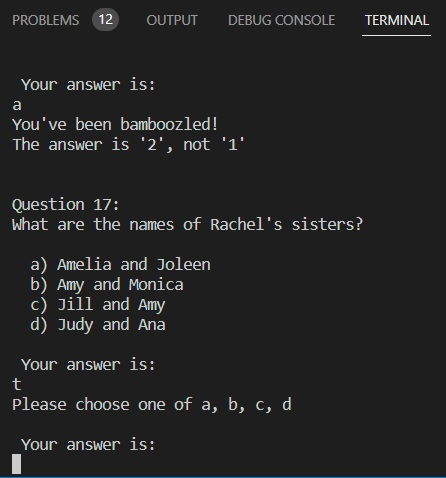

<h1>F.R.I.E.N.D.S Trivia Quiz Game</h1>
 
 
Friends Trivia is a Python terminal game, which runs in Code Institute mock terminal on Heroku. 
Users are asked to answer questions about Friends TV show to test their knowledge about the series.  
Each question comes with options from which the user can choose. 
At the end, the user finds out their score. 
[Link to live version of the game](https://friendsquiz03.herokuapp.com/)
 

 
 
<h2>How to play</h2>
This quiz has 10 questions about the F.R.I.E.N.D.S. TV series  
The game starts with a few instructions and asks the user for their name. 
Once the name is added, the game starts with the first question. All questions have 4 options to choose from. 
After each answer, the user receives a feedback to highlight if their answer was correct or not. The correct answer then is counted for the final result. 
After all 10 questions are answered, the user receives his total score. 
The user is then asked if he would like to give it another try one more time. If he agrees, the game starts with the first question.
 
<h2>Plan</h2>
 
- using LucidChart to frame out the code plan for the game. Maping out helped to see where I should start and where the game ends
 

 
<h2>Features</h2>

<h3>Existing Features</h3>
 
The 10 questions and the 4 options for each question are in radmon order. Each time the player plays the game, the questions and answers will be displayed differently. 
After each choice, the user receives feedback if their answer is correct and also the correct answer of that question in case the user's choice wasn't the correct one.

 
Each input for the answer is validated to make sure it is one of the options: a, b, c, or d. Uppercase of the four options is considered a valid answer, as the code transforms them in lowercase.

 
<h3>Features left to implement</h3>
- Questions stored in an external file 
- Results to be stored in an external file
 
<h2>Fixed Bugs</h2>
- User's answer was in the same line as the question. Resolved by adding \n at the end of the question. 
- Printing the delimitation symbol ~ gave an error: SyntaxError: invalid syntax. Fixed it by adding quotation marks around the symbols to make it a string. 
- Error running run.py because of an indentation error. Found that ":" was missing from the last question before the list of answers 
- Answers were showing in lists for each lowercase letter enumeration. The issue was a typo in print statement for printing the answers, instead of {option} it was {options} 
- Input to add the name after some questions to continue the game - I was calling the add_name function in the choices feedback. 
Trying to use the name from add_name function into a future function: using the global var option for name variable returned the error: global name = input("Enter your name to start the game:\n")
                ^
SyntaxError: invalid syntax 
I sorted the issue by taking the name input out of the function 
- Validate user answer if using uppercase - using lower() have transformed the answer to lowercase 
 
<h2>Data Model</h2>
 
The code is strucured on functions, one to print the initial message. An input request the name of the player, left outside of any functions to be able to be used in the feedback section. 
The questions are all part of a tuple, each stored with their answers. 
A helper function stores the code for the questions and number of questions. Another stores the options a user has and also their answer, validating it. The third function gives feedback on answers. 
A main function calles the fuction to start the game. 
A final function asks the user if he would like to restart the game, if answer is yes, the start the game function is called again. 
<h2>Testing</h2>
 
- I've tested in my terminal and Heroku Terminal 
- Passed the code through PEP liner, except with a few spacing notifications, the code had no errors
 
<h3>Validator testing</h3>
 
-No errors were returned when passing through the PEP8 Linter - https://pep8ci.herokuapp.com/ just spacing suggestions
 
<h2>Deployment</h2>
 
- This project was deployed using Code Institute mock terminal for Heroku
 
A. Fork or clone this repository
 
B. Create a new Heroku app
 
C. Set the buildbacks to Python and NodeJs in that order
 
D. Link the Heroku app to the repository
 
E.Click on Deploy
 
<h2>Credits</h2>
 
- My mentor Jubril Akolade for overviewing the project and suggesting a few changes to be more user-friendly 
- Stack Overflow - in finding the string to import for lowercase enumeration and finding the while loop for play again option 
- Realpython.com in helping organising my code in functions 